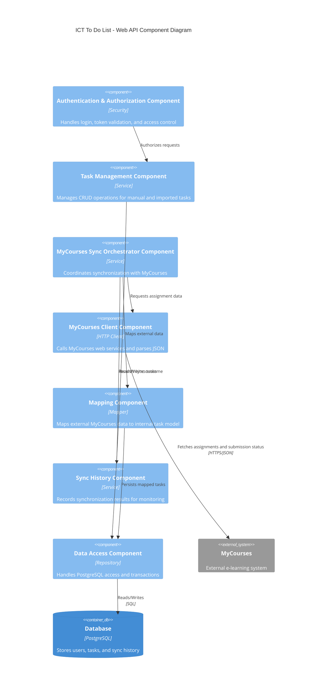

```mermaid
C4Component
title ICT To Do List - Web API Component Diagram

Component(auth, "Authentication & Authorization Component", "Security", "Handles login, token validation, and access control")
Component(task, "Task Management Component", "Service", "Manages CRUD operations for manual and imported tasks")
Component(sync, "MyCourses Sync Orchestrator Component", "Service", "Coordinates synchronization with MyCourses")
Component(client, "MyCourses Client Component", "HTTP Client", "Calls MyCourses web services and parses JSON")
Component(mapper, "Mapping Component", "Mapper", "Maps external MyCourses data to internal task model")
Component(history, "Sync History Component", "Service", "Records synchronization results for monitoring")
Component(data, "Data Access Component", "Repository", "Handles PostgreSQL access and transactions")

System_Ext(mycourses, "MyCourses", "External e-learning system")
ContainerDb(db, "Database", "PostgreSQL", "Stores users, tasks, and sync history")

Rel(auth, task, "Authorizes requests")
Rel(task, data, "Reads/Writes tasks")
Rel(sync, client, "Requests assignment data")
Rel(client, mycourses, "Fetches assignments and submission status", "HTTPS/JSON")
Rel(sync, mapper, "Maps external data")
Rel(mapper, data, "Persists mapped tasks")
Rel(sync, history, "Records sync outcome")
Rel(data, db, "Reads/Writes", "SQL")
```