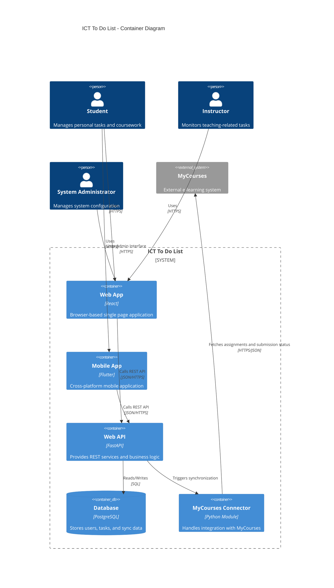

```mermaid
C4Container
title ICT To Do List - Container Diagram

Person(student, "Student", "Manages personal tasks and coursework")
Person(instructor, "Instructor", "Monitors teaching-related tasks")
Person(admin, "System Administrator", "Manages system configuration")

System_Boundary(ict, "ICT To Do List") {

  Container(web, "Web App", "React", "Browser-based single page application")
  Container(mobile, "Mobile App", "Flutter", "Cross-platform mobile application")
  Container(api, "Web API", "FastAPI", "Provides REST services and business logic")
  ContainerDb(db, "Database", "PostgreSQL", "Stores users, tasks, and sync data")
  Container(connector, "MyCourses Connector", "Python Module", "Handles integration with MyCourses")
}

System_Ext(mycourses, "MyCourses", "External e-learning system")

Rel(student, web, "Uses", "HTTPS")
Rel(student, mobile, "Uses", "HTTPS")
Rel(instructor, web, "Uses", "HTTPS")
Rel(admin, web, "Uses Admin Interface", "HTTPS")

Rel(web, api, "Calls REST API", "JSON/HTTPS")
Rel(mobile, api, "Calls REST API", "JSON/HTTPS")

Rel(api, db, "Reads/Writes", "SQL")
Rel(api, connector, "Triggers synchronization")
Rel(connector, mycourses, "Fetches assignments and submission status", "HTTPS/JSON")
```