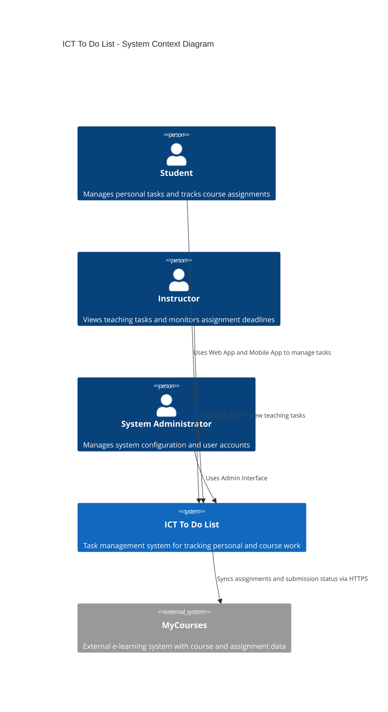

```mermaid
C4Context
title ICT To Do List - System Context Diagram

Person(student, "Student", "Manages personal tasks and tracks course assignments")
Person(instructor, "Instructor", "Views teaching tasks and monitors assignment deadlines")
Person(admin, "System Administrator", "Manages system configuration and user accounts")

System(todolist, "ICT To Do List", "Task management system for tracking personal and course work")
System_Ext(mycourses, "MyCourses", "External e-learning system with course and assignment data")

Rel(student, todolist, "Uses Web App and Mobile App to manage tasks")
Rel(instructor, todolist, "Uses Web App to view teaching tasks")
Rel(admin, todolist, "Uses Admin Interface")
Rel(todolist, mycourses, "Syncs assignments and submission status via HTTPS")
```